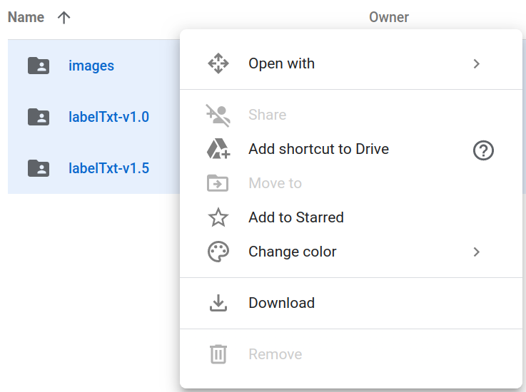

* Draft: 2020-10-05 (Mon)

# README-DOTA_dataset.md

## 1. Downloading the DOTA dataset

> **Data Download (from [the DOTA homepage](https://captain-whu.github.io/DOTA/dataset.html))**
>
> You can download DOTA-v1.0 from either Baidu Drive or Google Drive, according to your network connections.
>
> - DOTA-v1.0 on Baidu Drive: [Training set](https://pan.baidu.com/s/1kWyRGaz), [Validation set](https://pan.baidu.com/s/1qZCoF72), [Testing images](https://pan.baidu.com/s/1i6ly9Id)
> - DOTA-v1.0 on Google Drive: [Training set](https://drive.google.com/drive/folders/1gmeE3D7R62UAtuIFOB9j2M5cUPTwtsxK?usp=sharing), [Validation set](https://drive.google.com/drive/folders/1n5w45suVOyaqY84hltJhIZdtVFD9B224?usp=sharing), [Testing images](https://drive.google.com/drive/folders/1mYOf5USMGNcJRPcvRVJVV1uHEalG5RPl?usp=sharing)

### Downloading the dataset from Google Drive

There are three published links on Google Drive:

* [Training set](https://drive.google.com/drive/folders/1gmeE3D7R62UAtuIFOB9j2M5cUPTwtsxK?usp=sharing)
* [Validation set](https://drive.google.com/drive/folders/1n5w45suVOyaqY84hltJhIZdtVFD9B224?usp=sharing)
* [Testing images](https://drive.google.com/drive/folders/1mYOf5USMGNcJRPcvRVJVV1uHEalG5RPl?usp=sharing)

#### Downloading the `Training set`

All three sub-directories are selected and downloaded at the same time.



It took about an hour to zip and download the dataset. There were multiple files when the three sub-directories are actually downloaded.


Well, the download process was not smooth for me. The downloaded files below. 


When they're unzipped, the directory & file structures are different from those on Google Drive. So I had to double-check the files manually after the download. 

## 2. Verifying the downloads

Understanding the directory & file structures of the DOTA dataset on the Google Drive is useful to ensure all files are downloaded properly. So the directory & file structures are organized and summarized below. 

### 2.1. Dataset on Google Drive

#### Directory structure on Google Drive

```bash
(dota_on_google_drive)
├── train
│   ├── images
│   │   └── 1
│   ├── labelTxt-v1.0
│   └── labelTxt-v1.5
├── val
│   ├── images
│   ├── labelTxt-v1.0
│   └── labelTxt-v1.5
└── images
```

#### Full directory & file structure on Google Drive

```bash
(dota_on_google_drive)
├── train
│   ├── images
│   │   ├── 1
│   │   │   └── part1.zip
│   │   ├── part1.zip
│   │   ├── part2.zip
│   │   └── part3.zip
│   ├── labelTxt-v1.0
│   │   ├── labelTxt.zip
│   │   └── Train_Task2_gt.zip
│   └── labelTxt-v1.5
│       ├── DOTA-v1.5_train_hbb.zip
│       └── DOTA-v1.5_train.zip
├── val
│   ├── images
│   │   └── part1.zip
│   ├── labelTxt-v1.0
│   │   ├── labelTxt.zip
│   │   └── Val_Task2_gt.zip
│   └── labelTxt-v1.5
│       ├── DOTA-v1.5_val_hbb.zip
│       └── DOTA-v1.5_val.zip
└── images
    ├── part1.zip
    ├── part2.zip
    └── test_info.json

10 directories, 16 files
```

### 2.2. Recommended Directory Structure for the dataset

While downloading the `Training set`, let's refer to a web article at [AerialDetection](https://github.com/dingjiansw101/AerialDetection)/[GETTING_STARTED.md](https://github.com/dingjiansw101/AerialDetection/blob/master/GETTING_STARTED.md). 

#### Preparing the DOTA dataset

This article explains how to prepare the dataset and is useful to learn about the recommended directory structure for [AerialDetection](https://github.com/dingjiansw101/AerialDetection).

> **Prepare DOTA dataset**
>
> It is recommended to symlink the dataset root to `AerialDetection/data`. Here, we give an example for single scale data preparation of DOTA-v1.0. First, make sure your initial data are in the following structure.
>
> ```bash
> data/dota
> ├── train
> │   ├──images
> │   └── labelTxt
> ├── val
> │   ├── images
> │   └── labelTxt
> └── test
>     └── images
> ```

Notice the above structure is different from the directory structure on Google Drive.

```bash
(dota_on_google_drive)
├── train
│   ├── images
│   │   └── 1
│   ├── labelTxt-v1.0
│   └── labelTxt-v1.5
├── val
│   ├── images
│   ├── labelTxt-v1.0
│   └── labelTxt-v1.5
└── images
```

### 2.3. Directory structure of the downloaded dataset files

#### For the`Training set`

All the downloaded files have already been moved to directory `data/dota/train` and unzipped with the `unzip` command.

```bash
$ cd data/dota/train
$ tree
.
├── drive-download-20201005T030556Z-001.zip
├── images
│   ├── P0006.png
  ...
│   └── P1396.png
├── part1-002.zip
├── part2-003.zip
└── test_info.json
1 directory, 473 files
$
```

The full set of commands is below.

```bash
$ cd data/dota/train
$ ls
drive-download-20201005T003704Z-001.zip  drive-download-20201005T003704Z-003.zip  part2-004.zip  part3-002.zip
$ unzip drive-download-20201005T003704Z-001.zip 
Archive:  drive-download-20201005T003704Z-001.zip
  inflating: labelTxt-v1.0/labelTxt.zip  
  inflating: labelTxt-v1.0/Train_Task2_gt.zip  
  inflating: labelTxt-v1.5/DOTA-v1.5_train.zip  
  inflating: labelTxt-v1.5/DOTA-v1.5_train_hbb.zip  
  inflating: images/1/part1.zip      ls
$ tree
.
  ...
├── images
│   └── 1
│       └── part1.zip
├── labelTxt-v1.0
│   ├── labelTxt.zip
│   └── Train_Task2_gt.zip
├── labelTxt-v1.5
│   ├── DOTA-v1.5_train_hbb.zip
│   └── DOTA-v1.5_train.zip
  ...
$ unzip drive-download-20201005T003704Z-003.zip 
Archive:  drive-download-20201005T003704Z-003.zip
  inflating: images/part1.zip        
$ unzip part2-004.zip 
Archive:  part2-004.zip
  inflating: images/P0907.png    
  ...
  inflating: images/P1909.png        
$ unzip part3-002.zip
Archive:  part3-002.zip
  inflating: images/P1910.png 
  ...
  inflating: images/P2805.png
$
```

#### For the `Validation set`

All the downloaded files have already been moved to directory `data/dota/val` and unzipped with the `unzip` command.

```bash
$ cd data/dota/val
$ tree
.
├── drive-download-20201005T021234Z-001.zip
├── images
│   ├── P0003.png
  ...
│   └── P2802.png
├── labelTxt-v1.0
│   ├── labelTxt.zip
│   └── Val_Task2_gt.zip
├── labelTxt-v1.5
│   ├── DOTA-v1.5_val_hbb.zip
│   └── DOTA-v1.5_val.zip
└── part1-002.zip

3 directories, 464 files
$
```

The full set of commands is below.

```bash
$ cd data/dota/val
$ ls
drive-download-20201005T021234Z-001.zip  part1-002.zip
$ unzip drive-download-20201005T021234Z-001.zip 
Archive:  drive-download-20201005T021234Z-001.zip
  inflating: labelTxt-v1.0/Val_Task2_gt.zip  
  inflating: labelTxt-v1.0/labelTxt.zip  
  inflating: labelTxt-v1.5/DOTA-v1.5_val_hbb.zip  
  inflating: labelTxt-v1.5/DOTA-v1.5_val.zip  
(base) ➜  val unzip part1-002.zip 
Archive:  part1-002.zip
   creating: images/
  inflating: images/P0003.png        
  ...
  inflating: images/P2802.png
$ tree
.
├── drive-download-20201005T021234Z-001.zip
├── images
│   ├── P0003.png
  ...
│   └── P2802.png
├── labelTxt-v1.0
│   ├── labelTxt.zip
│   └── Val_Task2_gt.zip
├── labelTxt-v1.5
│   ├── DOTA-v1.5_val_hbb.zip
│   └── DOTA-v1.5_val.zip
└── part1-002.zip
```

#### For the `Testing images`

All the downloaded files have already been moved to directory `data/dota/images` and unzipped with the `unzip` command.

```bash
$ cd data/dota/images
$ tree
.
├── drive-download-20201005T030556Z-001.zip
├── images
│   ├── P0006.png
  ...
│   └── P1396.png
├── part1-002.zip
├── part2-003.zip
└── test_info.json

1 directory, 473 files
$
```

The full set of commands is below.

```bash
$ cd data/dota/images
$ ls
drive-download-20201005T030556Z-001.zip  part1-002.zip  part2-003.zip
$ unzip drive-download-20201005T030556Z-001.zip 
Archive:  drive-download-20201005T030556Z-001.zip
  inflating: test_info.json     
unzip part1-002.zip 
Archive:  part1-002.zip
   creating: images/
  inflating: images/P0006.png 
  inflating: images/P1396.png
$
```

### 2.4. Redo: downloading the files one by one from Google Drive

#### Mismatches in the directory and file structure 

Given the three published links on Google Drive, 

* [Training set](https://drive.google.com/drive/folders/1gmeE3D7R62UAtuIFOB9j2M5cUPTwtsxK?usp=sharing)
* [Validation set](https://drive.google.com/drive/folders/1n5w45suVOyaqY84hltJhIZdtVFD9B224?usp=sharing)
* [Testing images](https://drive.google.com/drive/folders/1mYOf5USMGNcJRPcvRVJVV1uHEalG5RPl?usp=sharing)

selecting all the sub-directories for each published link didn't work as good as I expected. After downloading all the links, the downloaded files are moved manually to the following sub-directory:

* [Training set](https://drive.google.com/drive/folders/1gmeE3D7R62UAtuIFOB9j2M5cUPTwtsxK?usp=sharing)      --> `data/dota/train`
* [Validation set](https://drive.google.com/drive/folders/1n5w45suVOyaqY84hltJhIZdtVFD9B224?usp=sharing)   --> `data/dota/val`
* [Testing images](https://drive.google.com/drive/folders/1mYOf5USMGNcJRPcvRVJVV1uHEalG5RPl?usp=sharing) --> `data/dota/images`

And then the compressed files are unzipped one by one resulting in the following directory structure.

```bash
$ cd data/dota
$ tree -d
.
├── images
│   └── images
├── train
│   ├── images
│   │   └── 1
│   ├── labelTxt-v1.0
│   └── labelTxt-v1.5
└── val
    ├── images
    ├── labelTxt-v1.0
    └── labelTxt-v1.5
11 directories
$
```

The `images` directories are different in the above and following structures.

```
(dota_on_google_drive)
├── train
│   ├── images
│   │   └── 1
│   ├── labelTxt-v1.0
│   └── labelTxt-v1.5
├── val
│   ├── images
│   ├── labelTxt-v1.0
│   └── labelTxt-v1.5
└── images
```

When the file structures are compared, they are quite different. 

#### Redo: download files on Google Drive one by one

I've downloaded each file on Google Drive one by one just to match not only the directory structure, but also the file structure of Google Drive. The following directory and file structure shows the same structures on Google Drive with an exception of `part1.zip.zip（副本）`. This file name on Google Drive is `part1.zip` . `副本` means a copy or replica.

```bash
$ cd data/dota
$ tree
(dota_on_local_disk)
├── images
│   ├── part1.zip
│   ├── part2.zip
│   └── test_info.json
├── train
│   ├── images
│   │   ├── 1
│   │   │   └── part1.zip.zip（副本）
│   │   ├── part1.zip
│   │   ├── part2.zip
│   │   └── part3.zip
│   ├── labelTxt-v1.0
│   │   ├── labelTxt.zip
│   │   └── Train_Task2_gt.zip
│   └── labelTxt-v1.5
│       ├── DOTA-v1.5_train_hbb.zip
│       └── DOTA-v1.5_train.zip
└── val
    ├── images
    │   └── part1.zip
    ├── labelTxt-v1.0
    │   ├── labelTxt.zip
    │   └── Val_Task2_gt.zip
    └── labelTxt-v1.5
        ├── DOTA-v1.5_val_hbb.zip
        └── DOTA-v1.5_val.zip

10 directories, 16 files
$
```

Note `(dota_on_local_disk)` is manually edited from `.` to emphasize this structure is on the local disk.

## 3. Commands in Action

There are mismatches in structures: Google Drive - Local Disk - recommended directory structure (at [Getting Started](https://github.com/dingjiansw101/AerialDetection/blob/master/GETTING_STARTED.md) > Prepare DOTA dataset). Previously, mismatched between Google Drive and Local Disk are fixed in a manner to match the structures on the local disk to those on Google Drive.


Now the remaining task is to transform the local disk into the the recommended structures.

### Back up the downloaded DOTA dataset (on Google Drive)

Notice

* `(dota_on_local_disk)` corresponds to `dota` in the following command. 
* The file name is `dota_dataset_on_google_drive.tar.gz` because the structures are identical.
* The file size reaches `22.3 GB`.

```bash
$ tar -zcvf dota_dataset_on_google_drive.tar.gz dota  
dota/
dota/images/
dota/images/part1.zip
dota/images/part2.zip
dota/images/test_info.json
dota/val/
dota/val/labelTxt-v1.5/
dota/val/labelTxt-v1.5/DOTA-v1.5_val_hbb.zip
dota/val/labelTxt-v1.5/DOTA-v1.5_val.zip
dota/val/images/
dota/val/images/part1.zip
dota/val/labelTxt-v1.0/
dota/val/labelTxt-v1.0/labelTxt.zip
dota/val/labelTxt-v1.0/Val_Task2_gt.zip
dota/train/
dota/train/labelTxt-v1.5/
dota/train/labelTxt-v1.5/DOTA-v1.5_train.zip
dota/train/labelTxt-v1.5/DOTA-v1.5_train_hbb.zip
dota/train/images/
dota/train/images/part1.zip
dota/train/images/part2.zip
dota/train/images/part3.zip
dota/train/images/1/
dota/train/images/1/part1.zip.zip（副本）
dota/train/labelTxt-v1.0/
dota/train/labelTxt-v1.0/labelTxt.zip
dota/train/labelTxt-v1.0/Train_Task2_gt.zip
$
```

### Transform the directory structure

What was done is summarized below.

```bash
(dota_on_local_disk)
├── train
│   ├── images
│   │   ├── 1         --> Remove this directory because . 副本 means a replica.
│   ├── labelTxt-v1.0 --> Change name to labelTxt
│   └── labelTxt-v1.5 --> Remove this directory
├── val
│   ├── images
│   ├── labelTxt-v1.0 --> Change name to labelTxt
│   └── labelTxt-v1.5 --> remove this directory
└── images -------------> Change name to test.
```

The directory name of `images` is changed to `test` because, later, the downloaded files will create a subdirectory `images` when they are unzipped. 

The recommended structure is below.

```bash
data/dota
├── train
│   ├── images
│   └── labelTxt
├── val
│   ├── images
│   └── labelTxt
└── test
 └── images
```

After the changes the directory structure becomes identical. Note the above and following results are edited in the order of test, val, and test for readability.

```bash
$ tree -d
.
├── train
│   ├── images
│   └── labelTxt
├── val
│   ├── images
│   └── labelTxt
└── test
    └── images

8 directories
$
```

### Back up the local dataset in the recommended structure

```bash
$ tar -zcvf dota_dataset_in_recommended_structure.tar.gz dota/
dota/
dota/test/
dota/test/images/
dota/test/images/part1.zip
dota/test/images/part2.zip
dota/test/images/test_info.json
dota/val/
dota/val/images/
dota/val/images/part1.zip
dota/val/labelTxt/
dota/val/labelTxt/labelTxt.zip
dota/val/labelTxt/Val_Task2_gt.zip
dota/train/
dota/train/images/
dota/train/images/part1.zip
dota/train/images/part2.zip
dota/train/images/part3.zip
dota/train/labelTxt/
dota/train/labelTxt/labelTxt.zip
dota/train/labelTxt/Train_Task2_gt.zip
$
```

### Uncompressing the compressed files

#### The Training set or `data/dota/train`


```bash
$ unzip part1.zip

$ unzip part2.zip

$ unzip part3.zip


```

```bash
$ cd labelTxt
$ unzip labelTxt.zip

```

```bash
$ unzip Train_Task2_gt.zip
```


```bash
  $ unzip part1.zip
  $ unzip part2.zip
  $ rm part1.zip part2.zip

```

TODO:

val/part1.zip

because unzipping `part1.zip` will create a sub-directory `images`.


```bash
$ cd labelTxt
$ unzip labelTxt.zip
Archive:  labelTxt.zip
  inflating: P0047.txt
  ...
  inflating: P0027.txt 
$
```


```bash
$ unzip Val_Task2_gt.zip
Archive:  Val_Task2_gt.zip
   creating: valset_reclabelTxt/
  inflating: valset_reclabelTxt/P0003.txt
  ...
  inflating: valset_reclabelTxt/P2802.txt 
$
```

```bash
$ tree -d
.
├── test
│   └── images
├── train
│   ├── images
│   ├── labelTxt
│   └── trainset_reclabelTxt
└── val
    ├── images
    ├── labelTxt
    └── valset_reclabelTxt

10 directories
$
```

