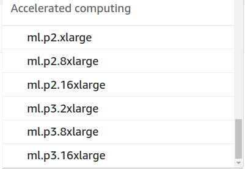

* Draft: 2020-10-03 (Sat)

# compile.sh Fails to Compile

Cuda extensions fail to compile with `compile.sh`. 

## Problem1

In a SageMaker instance, `compile.sh` has failed. Some of the error messages look like below.

```bash
(AerialDetection) sh-4.2$ chmod +x compile.sh 
(AerialDetection) sh-4.2$ ./compile.sh
Building roi align op...
No CUDA runtime is found, using CUDA_HOME='/usr/local/cuda-10.1'
running build_ext
/home/ec2-user/anaconda3/envs/AerialDetection/lib/python3.6/site-packages/torch/utils/cpp_extension.py:216: UserWarning: 

                               !! WARNING !!

!!!!!!!!!!!!!!!!!!!!!!!!!!!!!!!!!!!!!!!!!!!!!!!!!!!!!!!!!!!!!!!!!!!!!!!!!!!!!!!
Your compiler (g++ 4.8.5) may be ABI-incompatible with PyTorch!
Please use a compiler that is ABI-compatible with GCC 4.9 and above.
See https://gcc.gnu.org/onlinedocs/libstdc++/manual/abi.html.

See https://gist.github.com/goldsborough/d466f43e8ffc948ff92de7486c5216d6
for instructions on how to install GCC 4.9 or higher.
!!!!!!!!!!!!!!!!!!!!!!!!!!!!!!!!!!!!!!!!!!!!!!!!!!!!!!!!!!!!!!!!!!!!!!!!!!!!!!!
  ...
```

The errors occur even when the `sudo` command is used.

```bash
(AerialDetection) sh-4.2$ sudo ./compile.sh
Building roi align op...
Traceback (most recent call last):
  File "setup.py", line 2, in <module>
    from torch.utils.cpp_extension import BuildExtension, CUDAExtension
ImportError: No module named torch.utils.cpp_extension
  ...
ImportError: No module named Cython.Build
  ...
ImportError: No module named Cython.Distutils
(AerialDetection) sh-4.2$ 
```

## Hint1

The `nvidia-smi` command is used to check the status of GPU.

```
(AerialDetection) sh-4.2$ nvidia-smi
NVIDIA-SMI has failed because it couldn't communicate with the NVIDIA driver. Make sure that the latest NVIDIA driver is installed and running.

(AerialDetection) sh-4.2$
```

Ah, my AWS instance is `ml.t2.xlarge`. So there is no GPU!

## Solution1

The AWS instance is upgraded to one with GPU or `ml.p2.xlarge`.




## Caution

After the instance is changed, the Conda environment is reverted to the default status. If you have installed Conda environment, it is gone.

```bash
sh-4.2$ conda info -e
# conda environments:
#
base                     /home/ec2-user/anaconda3
JupyterSystemEnv      *  /home/ec2-user/anaconda3/envs/JupyterSystemEnv
  ...
sh-4.2$
```

## Problem2

After changing the Amazon EC2 instance, the `nvidia-smi` command shows GPU exists and the CUDA version is 11.0.

```bash
(AerialDetection) $ nvidia-smi
Sat Oct  3 13:05:25 2020       
+-----------------------------------------------------------------------------+
| NVIDIA-SMI 450.51.05    Driver Version: 450.51.05    CUDA Version: 11.0     |
|-------------------------------+----------------------+----------------------+
  ...
+-----------------------------------------------------------------------------+
| Processes:                                                                  |
|  GPU   GI   CI        PID   Type   Process name                  GPU Memory |
|        ID   ID                                                   Usage      |
|=============================================================================|
|  No running processes found                                                 |
+-----------------------------------------------------------------------------+(AerialDetection) $
```

But running `compile.sh` still fails with `ImportError` while I followed the instructions at [AerialDetection](https://github.com/dacon-ai/AerialDetection)/[INSTALL.md](https://github.com/dacon-ai/AerialDetection/blob/master/INSTALL.md). 

```bash
(AerialDetection) sh-4.2$ sudo ./compile.sh
Building roi align op...
Traceback (most recent call last):
  File "setup.py", line 2, in <module>
    from torch.utils.cpp_extension import BuildExtension, CUDAExtension
ImportError: No module named torch.utils.cpp_extension
  ...
ImportError: No module named Cython.Build
  ...
ImportError: No module named Cython.Distutils
(AerialDetection) sh-4.2$ 
```

## Actions2

Google search: amazon sagemaker "ImportError: No module named torch.utils.cpp_extension"


```bash
#!/usr/bin/env bash

PYTHON=${PYTHON:-"python"}

echo $PYTHON
exit

echo "Building roi align op..."
cd mmdet/ops/roi_align
if [ -d "build" ]; then
    rm -r build
fi
$PYTHON setup.py build_ext --inplace
  ...
```


```python
from setuptools import setup
from torch.utils.cpp_extension import BuildExtension, CUDAExtension

setup(
    name='roi_align_cuda',
    ext_modules=[
        CUDAExtension('roi_align_cuda', [
            'src/roi_align_cuda.cpp',
            'src/roi_align_kernel.cu',
        ]),
    ],
    cmdclass={'build_ext': BuildExtension})
```

Running the 

```bash
$ python
Python 3.6.10 |Anaconda, Inc.| (default, Mar 25 2020, 23:51:54) 
[GCC 7.3.0] on linux
Type "help", "copyright", "credits" or "license" for more information.
>>> from torch.utils.cpp_extension import BuildExtension, CUDAExtension
>>> 
```

