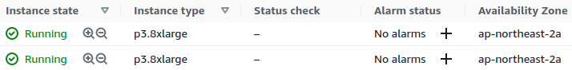

* Draft: 2021-04-27 (Tue)

# Basic Tricks to Run Multinode Training on Amazon EC2

* This article is necessary after learning the distributed data parallel.
* It is located here just because this topic is related to setting up the computing environment.

One of the basic settings is to launch instances WITHIN the same availability zone.

The port used by each node must be open.

