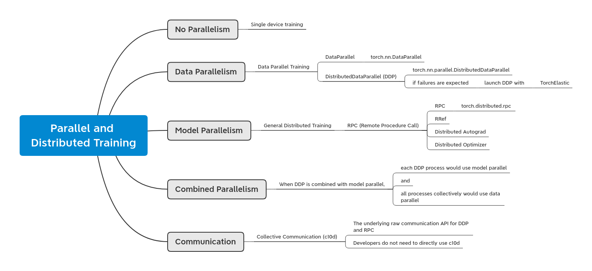

* Draft: 2021-04-26 (Mon)

# Overview of Parallel and Distributed Training

## Overview

* [PyTorch Distributed Overview](https://pytorch.org/tutorials/beginner/dist_overview.html), Shen Li
  * overviews the `torch.distributed` package
    * which can be categorized into three main components:
      * [Distributed Data-Parallel Training](https://pytorch.org/docs/master/generated/torch.nn.parallel.DistributedDataParallel.html) (DDP),
      * [RPC-Based Distributed Training](https://pytorch.org/docs/master/rpc.html) (RPC), and
      * [Collective Communication](https://pytorch.org/docs/stable/distributed.html) (c10d) library.
  * This tutorial is written to
    * categorize many documents or tutorials into different topics
    * and describe them briefly.



## Introduction

* Most of the existing documents are written for either DDP or RPC.
* Developers do not need to directly use c10d which is the underlying raw communication API for DDP and RPC.
* When DDP is combined with model parallel, each DDP process would use model parallel, and all processes collectively would use data parallel.

**[Distributed Data-Parallel Training](https://pytorch.org/docs/master/generated/torch.nn.parallel.DistributedDataParallel.html) (DDP)**

> * DDP is a single-program multiple-data training paradigm.
> * The model is replicated on every process, and every model replica will be fed with a different set of input data samples.
> * DDP takes care of gradient communications to keep model replicas synchronized and overlaps it with the gradient computations to speed up training.

**[RPC-Based Distributed Training](https://pytorch.org/docs/master/rpc.html)**

* The title of the above link is [DISTRIBUTED RPC FRAMEWORK](https://pytorch.org/docs/master/rpc.html).
  * RPC (Remote Procedure Call)

> * The distributed RPC framework provides
>   * mechanisms for multi-machine model training 
>     * through a set of primitives to allow for remote communication
>   * and a higher-level API to automatically differentiate models split across several machines.

* RPC-Based Distributed Training
  * is developed to support general training structures
    * that cannot fit into data-parallel training such as
      * distributed pipeline parallelism,
      * parameter server paradigm, and
      * combination of DDP with other training paradigms.
        * e.g. reinforcement learning applications with multiple observers or agents

[Collective Communication](https://pytorch.org/docs/stable/distributed.html) (c10d) library

> * DDP and RPC are built on c10d as of v1.6.0.
>   * DDP uses collective communications.
>   * RPC uses P2P communications.
> * The library supports sending tensors across processes within a group and offers both
>   * collective communication APIs
>     * e.g., [all_reduce](https://pytorch.org/docs/stable/distributed.html#torch.distributed.all_reduce) and [all_gather](https://pytorch.org/docs/stable/distributed.html#torch.distributed.all_gather)
>   * and P2P communication APIs
>     * e.g., [send](https://pytorch.org/docs/stable/distributed.html#torch.distributed.send) and [isendGeneral Distributed Training](https://pytorch.org/docs/stable/distributed.html#torch.distributed.isend)
> * Usually, developers do not need to directly use this raw communication API.
> * There are use cases where this API is still helpfuful.
>   * e.g.  distributed parameter averaging

## Data Parallel Training (with DataParallel and DDP)

### The common development trajectory 

* from simple to complex
* from prototype to production

1. single-device training
   * the data and model can fit in one GPU
   * the training speed is not a concern
2. single-machine multi-GPU 
   * [DataParallel](https://pytorch.org/docs/master/generated/torch.nn.DataParallel.html) / torch.nn.DataParallel
     * speeds up the training
     * requires a one-line change to the application code
3. single-machine multi-GPU
   * [DistributedDataParallel](https://pytorch.org/docs/master/generated/torch.nn.parallel.DistributedDataParallel.html) (DDP) / torch.nn.parallel.DistributedDataParallel
     * speeds up more 
     * requires one more step to set up
4. multi-machine multi-GPU
   * [DistributedDataParallel](https://pytorch.org/docs/master/generated/torch.nn.parallel.DistributedDataParallel.html) and the [launching script](https://github.com/pytorch/examples/blob/master/distributed/ddp/README.md)
     * speeds up more and more
     * scales across machine boundaries
5. [torchelastic](https://pytorch.org/elastic) 
   * launches distributed training
   * is used if
     * errors are expected, e.g. OOM (Out-Of Memory)
     * the resources can join and leave dynamically during the training

> Note 
>
> ​	Data-parallel training also works with [Automatic Mixed Precision (AMP)](https://pytorch.org/docs/master/notes/amp_examples.html#working-with-multiple-gpus).

### [DataParallel](https://pytorch.org/docs/master/generated/torch.nn.DataParallel.html) / torch.nn.DataParallel 

* DataParallel

  * speeds up the training

    * is very easy to use
    * does not offer the best performance.

  * requires a one-line change to the application code.

    * ```python
      import torch.nn as nn           # also used in single-device training
      model = nn.DataParallel(model)  # nn.DataParallel
      ```

* Single-machine multi-GPU tutorial
  * [OPTIONAL: DATA PARALLELISM](https://pytorch.org/tutorials/beginner/blitz/data_parallel_tutorial.html), Sung Kim and Jenny Kang
  * DataParallel is single-process, multi-thread, and only works on a single machine.

### [DistributedDataParallel](https://pytorch.org/docs/master/generated/torch.nn.parallel.DistributedDataParallel.html) (DDP) / torch.nn.parallel.DistributedDataParallel

* DistributedDataParallel (DDP)

  * speeds up more

    * DDP uses multi-process parallelism
      * no GIL contention exists across model replicas
    * the model is broadcast at DDP construction time instead of in every forward pass
    * Refer to [DDP paper](http://www.vldb.org/pvldb/vol13/p3005-li.pdf) (VLDB’20)
      * for more in-depth explanation of the performance optimization techniques.

  * requires one more step to set up

    * calling [init_process_group](https://pytorch.org/docs/stable/distributed.html#torch.distributed.init_process_group)

    * ```python
      TorchElastic
      With the growth of the application complexity and scale, failure recovery becomes an imperative requirement. Sometimes, it is inevitable to hit errors like OOM when using DDP, but DDP itself cannot recover from those errors nor does basic try-except block work. This is because DDP requires all processes to operate in a closely synchronized manner and all AllReduce communications launched in different processes must match. If one of the processes in the group throws an OOM exception, it is likely to lead to desynchronization (mismatched AllReduce operations) which would then cause a crash or hang. If you expect failures to occur during training or if resources might leave and join dynamically, please launch distributed data-parallel training using torchelastic.# Code example
      from torch.nn.parallel import DistributedDataParallel as DDP
      
      # and a little bit more lines
      ```

* DDP is multi-process and works for both single- and multi- machine training.
  * single-machine multi-GPU
    * DDP
      * speeds up more 
      * requires one more step to set up
  * multi-machine multi-GPU
    * DDP and the [launching script](https://github.com/pytorch/examples/blob/master/distributed/ddp/README.md)
      * speeds up more and more
      * scales across machine boundaries
* **Tutorials**
  * Starter example
    * [DDP notes](https://pytorch.org/docs/stable/notes/ddp.html)
      * with brief descriptions of DDP design and implementation
  * **Single-machine multi-GPU tutorial**
    * [Getting Started with Distributed Data Parallel](https://pytorch.org/tutorials/intermediate/ddp_tutorial.html), Shen Li (Joe Zhu)
      * explains some common problems with DDP training  including:
        * unbalanced workload,
        * checkpointing,
        * and multi-device models.
      * Prerequisites
        - [PyTorch Distributed Overview](https://pytorch.org/tutorials/beginner/dist_overview.html)
        - [DistributedDataParallel API documents](https://pytorch.org/docs/master/generated/torch.nn.parallel.DistributedDataParallel.html)
        - [DistributedDataParallel notes](https://pytorch.org/docs/master/notes/ddp.html)
  * **Model parallelism**
    * [Single-Machine Model Parallel Best Practices](https://pytorch.org/tutorials/intermediate/model_parallel_tutorial.html), Shen Li
      * DDP can be easily combined with single-machine multi-device model parallelism which is described in the tutorial.
  * **Multi-machine multi-GPU tutorial**
    * [Launching and configuring distributed data parallel applications](https://github.com/pytorch/examples/blob/master/distributed/ddp/README.md)
      * shows how to use the DDP launching script
  * Tutorial for an experimental API
    * [Shard Optimizer States With ZeroRedundancyOptimizer](https://pytorch.org/tutorials/recipes/zero_redundancy_optimizer.html) 
      * demonstrates how [ZeroRedundancyOptimizer](https://pytorch.org/docs/master/distributed.optim.html) helps to reduce optimizer memory footprint for distributed data-parallel training
      * [ZeroRedundancyOptimizer](https://pytorch.org/docs/master/distributed.optim.html)
        * is introduced in PyTorch 1.8 as a prototype feature.
        * is subject to change.

#### [Comparison between `DataParallel` and `DistributedDataParallel`](https://pytorch.org/tutorials/intermediate/ddp_tutorial.html#comparison-between-dataparallel-and-distributeddataparallel)

* `DistributedDataParallel` is usually faster than `DataParallel`
  *  even on a single machine due to:
    * GIL contention across threads,
    * per-iteration replicated model,
    * and additional overhead introduced by scattering inputs and gathering outputs.
* `DistributedDataParallel` is usually  more portable than `DataParallel`.
  * If your model is too large to fit on a single GPU, you must use **model parallel** to split it across multiple GPUs.
  * `DistributedDataParallel` works with **model parallel**; `DataParallel` does not at this time.

### TorchElastic

> * Launch distributed data-parallel training using [torchelastic](https://pytorch.org/elastic)
>   * if you expect failures to occur during training or if resources might leave and join dynamically.
>
> With the growth of the application complexity and scale, failure recovery becomes an imperative requirement. Sometimes, it is inevitable to hit errors like OOM when using DDP, but DDP itself cannot recover from those errors nor does basic `try-except` block work. This is because DDP requires all processes to operate in a closely synchronized manner and all `AllReduce` communications launched in different processes must match. If one of the processes in the group throws an OOM exception, it is likely to lead to desynchronization (mismatched `AllReduce` operations) which would then cause a crash or hang. 

## General Distributed Training (with RPC)

> * The [torch.distributed.rpc](https://pytorch.org/docs/master/rpc.html) package
>   * aims at supporting general distributed training scenarios.
>   * has four main pillars
>     * [RPC](https://pytorch.org/docs/master/rpc.html#rpc)
>     * [RRef](https://pytorch.org/docs/master/rpc.html#rref)
>     * [Distributed Autograd](https://pytorch.org/docs/master/rpc.html#distributed-autograd-framework)
>     * [Distributed Optimizer](https://pytorch.org/docs/master/rpc.html#module-torch.distributed.optim)
> * [RPC](https://pytorch.org/docs/master/rpc.html#rpc)
>   * supports running a given function on a remote worker.
> * [RRef](https://pytorch.org/docs/master/rpc.html#rref)
>   * helps to manage the lifetime of a remote object.
>   * The reference counting protocol is presented in the [RRef notes](https://pytorch.org/docs/master/rpc/rref.html#remote-reference-protocol).
> * [Distributed Autograd](https://pytorch.org/docs/master/rpc.html#distributed-autograd-framework)
>   * extends the autograd engine beyond machine boundaries.
>   * Refer to [Distributed Autograd Design](https://pytorch.org/docs/master/rpc/distributed_autograd.html#distributed-autograd-design) for more details.
> * [Distributed Optimizer](https://pytorch.org/docs/master/rpc.html#module-torch.distributed.optim)
>   * automatically reaches out to all participating workers to update parameters using gradients computed by the distributed autograd engine.
> * Tutorials
>   * The [Getting Started with Distributed RPC Framework](https://pytorch.org/tutorials/intermediate/rpc_tutorial.html) tutorial first uses a simple Reinforcement Learning (RL) example to demonstrate RPC and RRef. Then, it applies a basic distributed model parallelism to an RNN example to show how to use distributed autograd and distributed optimizer.
>   * The [Implementing a Parameter Server Using Distributed RPC Framework](https://pytorch.org/tutorials/intermediate/rpc_param_server_tutorial.html) tutorial borrows the spirit of [HogWild! training](https://people.eecs.berkeley.edu/~brecht/papers/hogwildTR.pdf) and applies it to an asynchronous parameter server (PS) training application.
>   * The [Distributed Pipeline Parallelism Using RPC](https://pytorch.org/tutorials/intermediate/dist_pipeline_parallel_tutorial.html) tutorial extends the single-machine pipeline parallel example (presented in [Single-Machine Model Parallel Best Practices](https://pytorch.org/tutorials/intermediate/model_parallel_tutorial.html)) to a distributed environment and shows how to implement it using RPC.
>   * The [Implementing Batch RPC Processing Using Asynchronous Executions](https://pytorch.org/tutorials/intermediate/rpc_async_execution.html) tutorial demonstrates how to implement RPC batch processing using the [@rpc.functions.async_execution](https://pytorch.org/docs/master/rpc.html#torch.distributed.rpc.functions.async_execution) decorator, which can help speed up inference and training. It uses similar RL and PS examples employed in the above tutorials 1 and 2.
>   * The [Combining Distributed DataParallel with Distributed RPC Framework](https://pytorch.org/tutorials/advanced/rpc_ddp_tutorial.html) tutorial demonstrates how to combine DDP with RPC to train a model using distributed data parallelism combined with distributed model parallelism.
